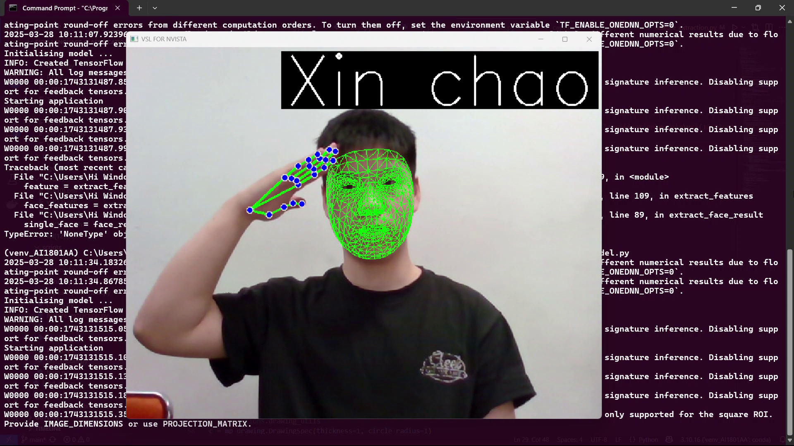
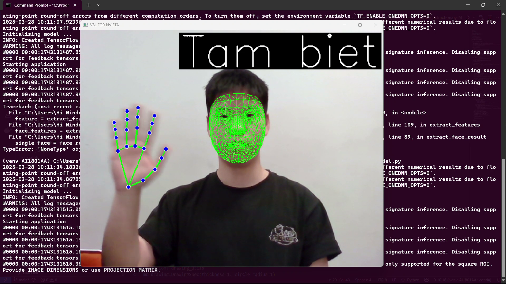
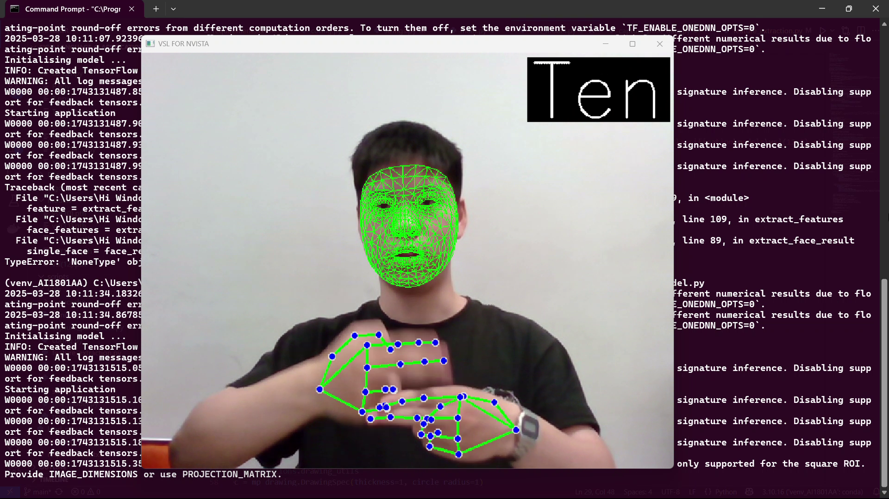

# Vietnamese Sign Language with Pose Estimation

## About

This project leverages Google's MediaPipe library to perform pose estimation on a webcam feed.

It then builds an LSTM model using the data from the pose estimation to classify Vietnamese sign language signals
## How to use the code

**Note**: You can already run the project at is with the collected data and trained model, but you can collect and train a model of your own using the following steps:

1) Clone the project.
```bash
https://github.com/phamduclong2101/VSL--Pose-Estimation.git
cd VSL--Pose-Estimation
```
2) Install the packages specified in ```requirements.txt```.
```
pip install -r requirements.txt
```
3) Set up the correct path for your project.
4) (OPTIONAL) Run the following command to collect the pose data for one single sign language symbol. (Use python3 if you using to linux)
```bash
python3 scripts/capture_pose_data.py --pose_name="[THE NAME OF THE ACTION]" --confidence=[THE CONFIDENCE OF THE POSE ESTIMATON MODEL (TYPICALLY 0.5)] --duration=[DATA COLLECTION PERIOD (TYPICALLY 60)]
```
5) (OPTIONAL) After collecting data for all the actions you want, train the model using the command
```bash
python3 scripts/train.py --model_name=[NAME OF THE MODEL YOU WANT] 
```
6) (OPTIONAL) Replace the name of the model name in ```config.py``` with your model name 
7) Run the Streamlit program or you want to test model using the command.
   
Run test model:
```bash
python3 test_model.py
```
Run streamlit:
```bash
streamlit run main.py
```
## Output samples:
<br>
"Xin chao"
<br> 
"Tam biet"
<br> 
"Ten"
<br> 

## Trained symbols
The trained symbols of the project include:
- Xin chao (VSL).
- Tam biet (VSL).
- Cam on (VSL).
- Yeu (VSL).
- Toi (VSL).
- Ban (VSL).
- Do nothing.
- ............  
